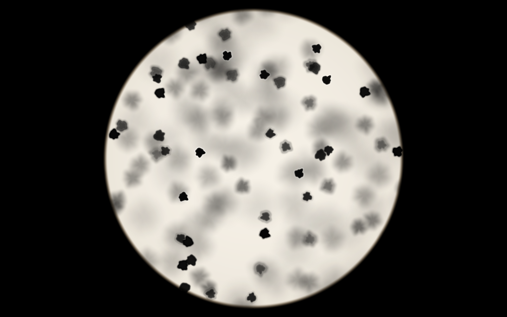
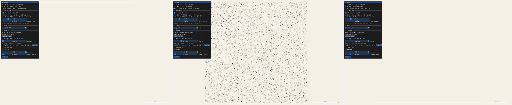
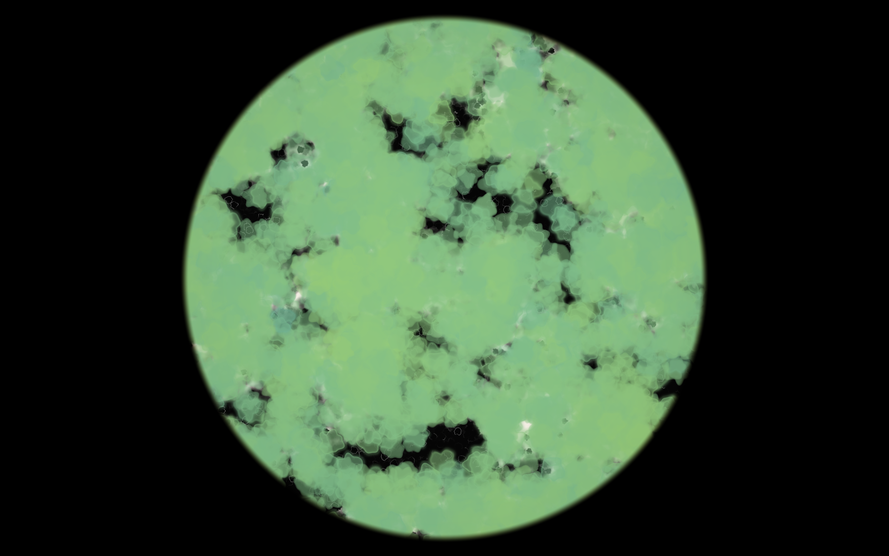
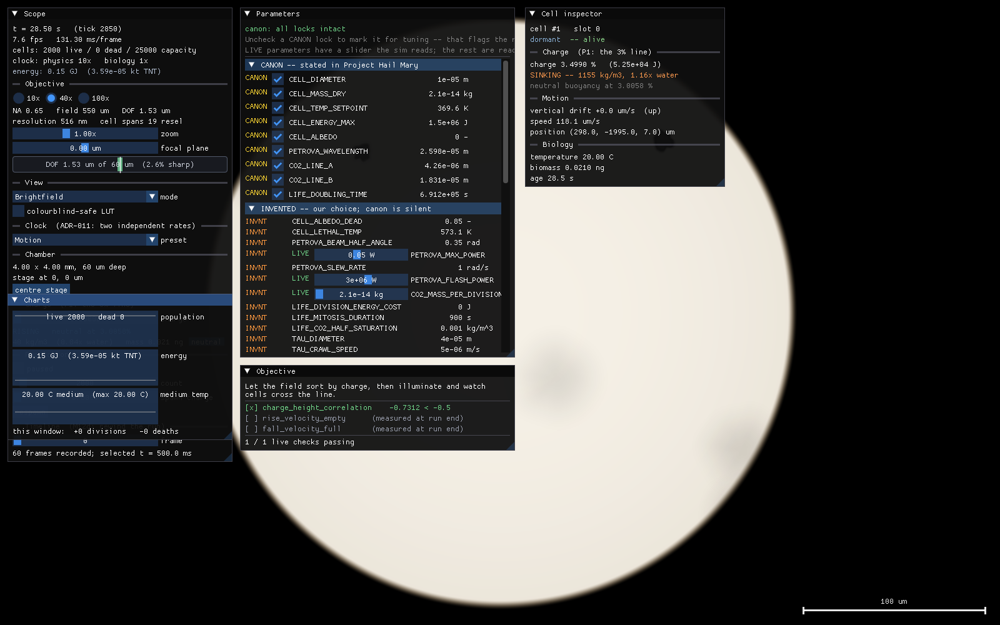
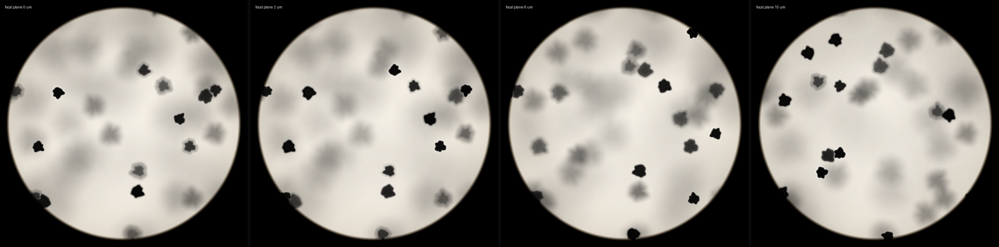

# Astrophage Microscope Simulator

**A physics-based, GPU-accelerated simulation of Astrophage — the fictional organism from Andy Weir's *Project Hail Mary* — viewed through a microscope.**

A sealed 4 mm chamber of water. Cells 10 μm across, black at every wavelength, each able to hold 1.5 MJ as neutrino mass. Real Stokes drag, Langevin dynamics, Fickian diffusion, conduction, photon momentum. Every constant is canon-locked and carries its provenance into the UI, so you can always see which numbers Weir wrote and which we made up.

Deliberately **not** the interstellar scale — no ships, no Petrova arc, no Tau Ceti. Just what you would see down the eyepiece.

```
Status:  M12g green · M14b demo  ·  C++20 + CUDA 13.1  ·  sm_89  ·  Windows 11
         All five signature phenomena, predation and the Taumoeba-82.5
         evolution arc, and eight self-verifying scenarios are live. The
         culture is now mouse-interactive — heat the slide to ignite it,
         just as in the novel. Render polish and packaging remain.
```



*25,000 cells in brightfield at the 40× working objective, inside the field diaphragm. Silhouettes are irregular and unique per cell, and area-preserving to machine precision — so an irregular cell absorbs exactly as much light as the sphere the physics models (ADR-023). Sharp cells sit within the 1.53 μm depth of field; everything else is energy-conserving defocus. The chamber is 4 mm across — this view is 550 μm of it.*

---

## The five phenomena worth building this for

Each of these **emerges** from the physics. None is special-cased anywhere in the code. If a feature needs an `if` to happen, it is a bug.

### P1 — The 3% line ✅ *live*



Canon says a cell is 10 μm across and masses 0.021 ng. That works out to **40 kg/m³ — twenty-five times lighter than water**. So an empty cell floats *up* at 52 μm/s. Charge it fully and the 16.69 ng of stored mass makes it **32× denser than water, denser than osmium**, and it sinks at 1681 μm/s.

Neutral buoyancy lands at exactly **3.006 % charge**. You can read a cell's charge from which way it drifts.

*Above: identical 25,000-cell populations after two simulated minutes, differing only in charge. Left 0 % (40 kg/m³, risen to the ceiling). Middle 3.0058 % (998 kg/m³, exactly water, suspended). Right 20 % (6415 kg/m³, on the floor). Verified: drift velocity is linear in charge to Pearson **−1.000000**, crossing zero at **3.00577 %** against a canon-derived 3.00577 %.*

### P2 — The perfect thermostat ✅ *live*

96.415 °C sits **3.585 K below water's boiling point**, and a cell's heat output falls to zero as the medium approaches its setpoint. So a live culture pins its water to 96.415 °C and **can never boil it**. Overheat the chamber from outside and the cells absorb the excess and drag it back down.

Weir picked that temperature from an unrelated proton-collision calculation. This consequence is free.

*Verified: 2,000 awake cells in an insulated chamber for 60 simulated seconds reach a maximum of **369.56 K** against a setpoint of 369.565 — pinned exactly, and 3.6 K short of boiling. Driven externally to 400 K, the medium relaxes back down and the cells' stored energy goes **up**: they absorbed the excess as neutrino mass.*

*A consequence that falls out of it: an ordinary chamber cannot starve a culture. The cells warm their own medium to the setpoint within a second, at which point they stop spending.*

### P3 — Ignition ✅ *live*

Below the setpoint, Astrophage is inert black powder. Heat the chamber past 96.415 °C once and the culture wakes — **irreversibly**. Chill it back down and it holds its own temperature anyway.

*Verified: 2,000 cells stay dormant indefinitely in cold water; all 2,000 wake within 50 ms of the chamber crossing the setpoint; all 2,000 are still awake after being chilled back to 20 °C for five seconds.*

### P4 — Live cells move ✅ *live*

A live cell holds its **surface** at 96.415 °C however cold the bulk is, and Stokes drag is set by the boundary layer at that surface — so viscosity drops 3.4× and Brownian diffusivity rises **4.36×**. Live and dead become distinguishable by eye, which is exactly the tell Ryland Grace uses.

### P5 — Absolute shadows ✅ *live*

Albedo is exactly zero at every wavelength ("super cross-sectionality"). In a lit dense culture the front row shadows everything behind it *perfectly*, so a lit monolayer forms and the back starves.

*Verified two ways, because the claim has two regimes. **Exactly**: a cell directly behind another receives irradiance of bitwise `0.0` and charges at bitwise zero rate — not "very little". **Statistically**: 8,000 cells lit along one axis show a charge-versus-depth correlation of **−0.879**, with the lit face holding 8× the energy of the far side.*

---

## Predation, and the Taumoeba-82.5 arc ✅ *live*



The **Taumoeba** — the amoeba that eats Astrophage — crawls, engulfs, digests, and **evolves**. Under a slowly rising nitrogen ramp, a population under genuine directional selection breeds the **Taumoeba-82.5** strain (N₂ tolerance ≥ 0.825) all by itself, deterministically, never by script; a constant-nitrogen control plateaus at 0.17, which is what proves the rise is selection and not drift. The predators are coloured by their tolerance — pale teal for the intolerant, gold-green for the evolved — so the arc is visible on screen: the swarm warms toward gold as selection does its work.

*Above: thousands of Taumoeba (bred from twenty) consuming a 24,000-cell culture, mid-evolution at mean tolerance 0.46. The black voids are where the culture has been eaten.*

---

## The instrument



Eight self-verifying scenarios play in the app and grade themselves live. Click a cell for its state and the P1 buoyancy line; the parameter table shows every constant with its provenance badge and canon lock, plus a live slider for the curated set the simulation actually reads; the objective panel checks the scenario's acceptance conditions each frame; and the timeline records a rolling ring of full-state snapshots you can rewind through. Everything here is procedural — there are no asset files.

---

## It behaves like a microscope



*The same field at the 100× oil objective with the focal plane at 0, 2, 6 and 15 μm. Different cells resolve in each panel — the depth of field is 0.61 μm inside a 60 μm chamber, so racking focus is how you find anything.*

The depth of field at the working objective is **1.53 μm inside a 60 μm chamber** — about 2.5 % of the culture is sharp at any moment. Racking focus is a primary control, not a garnish.

| Objective | NA | Resolution | Depth of field | Field of view | Cell spans |
|---|---|---|---|---|---|
| 10× survey | 0.25 | 1342 nm | 11.20 μm | 2200 μm | 7 resel |
| **40× working** | 0.65 | 516 nm | **1.53 μm** | 550 μm | 19 resel |
| 100× oil detail | 1.25 | 268 nm | 0.61 μm | 220 μm | 37 resel |

Defocus is **energy-conserving**: peak opacity falls as `(a/R_eff)²`, so a blurred cell absorbs exactly as much light as a focused one and merely spreads it. Without that term, defocused cells stay jet black and just grow, which reads as fog rather than depth. Cells render at **true relative size** — there is no visibility fudge, and the build greps for one.

---

## The physics

| | |
|---|---|
| **Motion** | Exact joint position–velocity Ornstein–Uhlenbeck propagator. Required, not chosen: an empty and a fully charged cell differ 800× in mass, so `dt/τ` spans 4497 to 5.65 and no simpler scheme covers both. |
| **Buoyancy** | `mass = biomass + energy/c²`, recomputed, never stored. Volume is constant — an enriched cell gains mass, not size. |
| **Diffusion** | Explicit FTCS, ping-pong buffers, 10 substeps per tick on a 512² grid. Validated against the exact 2D solution: a Gaussian spreads with `σ² = σ₀² + 2Dt` to **−0.00 %** error. |
| **Contact** | Soft-sphere, stiffness set by an overdamped stability bound rather than by taste. |
| **Neighbours** | Uniform spatial hash built by a **stable** radix sort — 0.110 ms at 200,000 cells, matching an O(n²) reference exactly. |

Reference machine: RTX 4070 Ti SUPER. 200,000 cells with full defocus, hashing, and contact run at 281 ticks/s.

---

## Determinism is a hard invariant

Same seed + same scenario + same tick count ⇒ identical state hash, every time. On a GPU that is not free, and three decisions exist purely to buy it:

- **Per-cell PCG32 streams**, keyed on a stable cell id rather than a slot or thread index. With a global generator, adding or removing one cell shifts every subsequent cell's draws — and that is every interesting run.
- **64-bit fixed-point accumulation** for all field deposits and statistics. `atomicAdd(float*)` is order-dependent because float addition is not associative; integer addition is not.
- **A stable sort for the spatial hash.** The textbook `atomicAdd` counting scatter randomises order *within* a bucket, which sets the summation order of contact forces, which breaks reproducibility intermittently — the worst way for anything to break.

---

## Canon, and honest invention

Every parameter is tagged `CANON` (stated in the novel), `DERIVED`, `REAL`, or `INVENTED`, and the tag follows it into the UI. Canon values are locked; unlocking one flags the run as non-canon in the HUD and in every telemetry export.

The novel contradicts itself twice, materially, and both readings ship as **playable options** rather than as a silent decision:

- **Cell density.** Canon says the cell is 10 μm across, masses 0.021 ng, *and* is "mostly water". Those cannot all be true — 0.021 ng in a 10 μm sphere is 40 kg/m³. Honouring the two hard numbers is what produces P1.
- **Dormancy.** Canon says the internal temperature is always 96.415 °C *and* that Astrophage is inert until heated past it. Resolved with a one-way ignition latch, which satisfies both and produces P3.

Every such adjudication is in [`docs/DECISIONS.md`](docs/DECISIONS.md) with its reasoning and its escape hatch.

---

## How it is built

Every physical number originates in [`scripts/canon.py`](scripts/canon.py). A generator emits the C++ header, the test goldens, **and** the verification document from it — so a constant cannot drift between code, test, and documentation, because none of the three is hand-written.

That verification document is computed from first principles *independently of the simulator*. It has caught four real errors so far, including one where the integrator this project's own spec called for turned out to give **47× too much diffusion**.

```
CLAUDE.md                  operating contract; session ritual, iron rules
docs/ARCHITECTURE.md       module map, invariants, glossary, anti-drift machinery
docs/PHYSICS.md            the model
docs/VERIFICATION.md       GENERATED physics oracle -- the numbers the sim must reproduce
docs/DECISIONS.md          28 ADRs: every canon contradiction and engineering choice
docs/MILESTONES.md         M0-M12, each with a machine-checkable gate
docs/SESSION_LOG.md        what happened, and what went wrong
_run_state/CONTINUATION_PROMPT.md   self-contained kickoff for a new session
contracts/                 frozen cross-module interfaces
scripts/canon.py           the single source of every physical number
```

A milestone is done only when `gate.ps1 -Milestone M<N>` exits 0, at which point it is tagged `m<N>-green`. `git tag --list` is therefore a complete and trustworthy status report. Every gate re-runs all earlier gates.

## Build

Requires CUDA 13.1+, MSVC 2022, CMake 3.27+, Python 3, and an NVIDIA GPU.

```bash
powershell -NoProfile -ExecutionPolicy Bypass -File scripts/build.ps1 -App
```

```bash
ctest --test-dir build --output-on-failure
```

```bash
build/astrophage.exe
```

Drag to pan the stage, scroll to zoom (cursor-anchored), `Home` to reset. Rack the **focal plane** slider and watch cells resolve and dissolve. Drag the **charge** slider past 3.0058 % and the culture reverses direction. `--ticks-per-frame 200` fast-forwards; the chamber stratifies fully in about two simulated minutes.

Without `-App`, the core library and the full test suite build with **no network and no external dependencies**.

## Roadmap

| M | Delivers | State |
|---|---|---|
| M0 | Harness: build system, generated canon, determinism oracle, gates | ✅ `m0-green` |
| M1 | Cell store, CUDA–GL interop, instanced rendering, camera, scale bar | ✅ `m1-green` |
| M2 | Motion: OU integrator, buoyancy → **P1** | ✅ `m2-green` |
| M3 | Microscope optics: defocus, depth of field, diffraction, objectives | ✅ `m3-green` |
| M4 | Spatial hash, soft-sphere contact, wall adhesion | ✅ `m4-green` |
| M5 | Fields: diffusion, fixed-point deposits, tool brushes | ✅ `m5-green` |
| M6 | Thermal: mass–energy, ignition latch, thermostat → **P2 P3 P4** | ✅ `m6-green` |
| M7 | Light: Petrova emission, photon thrust, total occlusion → **P5** | ✅ `m7-green` |
| M8 | Taxis: run-and-tumble phototaxis and chemotaxis | ✅ `m8-green` |
| M8b | Presentation: irregular cell morphology, field diaphragm, defocus culling | ✅ `m8b-green` |
| M9a | Life: CO₂ uptake, mitosis, reproducible division | ✅ `m9a-green` |
| M9b | Life: death, store disposition, telemetry reduction | ✅ `m9b-green` |
| M9c | Life: multi-rate clock, slot compaction, charts | ✅ `m9c-green` |
| M7b | View modes: Petrovascope, Thermal IR, Darkfield | ✅ `m7b-green` |
| M10a | Predation: Taumoeba store, crawl, engulfment | ✅ `m10a-green` |
| M10b | Evolution: N₂ lethality, heritable tolerance, Taumoeba-82.5 | ✅ `m10b-green` |
| M11a | Content: scenario spine — JSON loader, world instantiation, all 8 scenarios | ✅ `m11a-green` |
| M11b | Content: acceptance metrics, scenario driving, all 8 pass T24 | ✅ `m11b-green` |
| M11c | Content: runtime-parameter overlay, canon locks, non-canon flag, CSV export | ✅ `m11c-green` |
| M11d | Content: app auto-play of scenarios + the parameter inspector (provenance + canon locks) | ✅ `m11d-green` |
| M11e | Content: the objective/acceptance panel (live checkmarks, evaluated app-side) | ✅ `m11e-green` |
| M11f | Content: the cell inspector + the sim reading overridden params (live tuning) | ✅ `m11f-green` |
| M12a | Ship: snapshot save/load + replay determinism (T21) | ✅ `m12a-green` |
| M12b | Ship: Taumoeba rendering | ✅ `m12b-green` |
| M12c | Ship: performance pass — zero steady-state allocation + throughput (T28/T29) | ✅ `m12c-green` |
| M12d | Ship: time scrubber — rewind a run through an in-memory snapshot ring | ✅ `m12d-green` |
| M12e | Ship: render legibility — Taumoeba tolerance colour + colourblind LUT | ✅ `m12e-green` |
| M12f | Ship: render remainder — the view cross-fade slider | ✅ `m12f-green` |
| M12g | Ship: render remainder — `render_view_v3` + pre-ignition Thermal-IR warm-up | ✅ `m12g-green` |
| M12h | Ship: render remainder — real T-field false-colour behind Thermal IR | ☐ |
| M12i | Ship: render remainder — bloom over the Petrova emission | ☐ |
| M12j | Ship: packaging (clean-machine `.zip`), user guide, `v1.0` | ☐ |
| M13a | Interaction: field-brush toolset — poke the culture to ignite (heat/chill/CO₂/N₂) | ✅ `m13a-green` |
| M13b | Interaction: the light-leash + optical tweezers — herd the culture, tow a cell | ✅ `m13b-green` |
| M14a | Demo mode: the living-screensaver act engine + `--demo` loop | ✅ `m14a-green` |
| M14b | Demo mode: captions, camera drift, an idle yield, and the light-leash herding act | ✅ `m14b-green` |
| M14c | Demo mode: view cross-fades + cold-start screensaver trigger (needs M12f) | ☐ |

**M7 was the line where all five signature phenomena came live.** Everything after it adds behaviour and content on top of a physics core that is now complete.

The eight scenarios are live and self-verifying: *First Light* (heat a slide of inert powder until it ignites), *Three-Percent Line* (buoyancy sorting), *Komorov* (Dimitri's 1 kW laser on a microbalance), *Shadow Garden* (absolute self-shading), *Bloom* (population dynamics), *Taumoeba* (predation and the 82.5 arc), *Spin-Drive Face* — the one place the ship intrudes, because a spin drive is a cell-scale machine and the microscope is the right instrument to look at it — and a free-play *Sandbox*. Each loads, drives itself, and passes its acceptance block headlessly (`headless --scenario ID --assert`).

## Credit

Astrophage, Taumoeba, the Petrova line, and the Hail Mary are Andy Weir's, from *Project Hail Mary* (2021). This is an unaffiliated, non-commercial fan simulation.

Code is MIT licensed — see [LICENSE](LICENSE). The licence covers the code, not the fiction; see [NOTICE.md](NOTICE.md).

Built collaboratively with [Claude Code](https://claude.com/claude-code).
